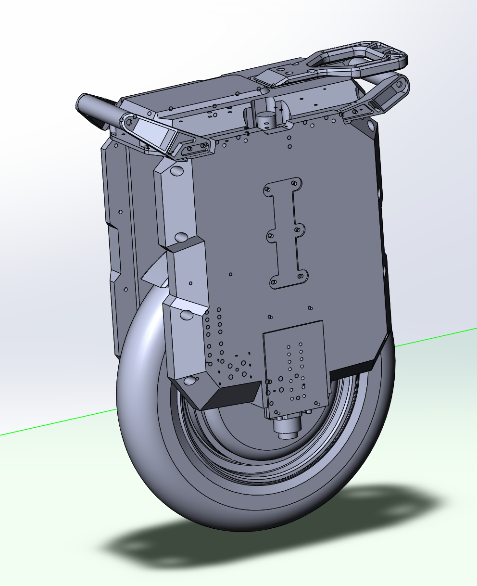

# Rocket

CAD model of Extreme Bull Rocket EUC. Shamelessly reverse engineered from its physical form. Modelled in SolidWorks 2024

## Current status

I did not use 3d scanning so most of the shell\outer parts are just kinda resembling the original. However almost all the holes, screw clearances and threads are pretty accurate. The main structural frame is pretty accurate as well.

## Contributing

PRs are welcome!

CAD models don't fit the usual git/github workflow with easily observable text file changes. Please add a thorough description as well some images to highlight what was changed in the PR.

## License

Just do whatever you want with these files
